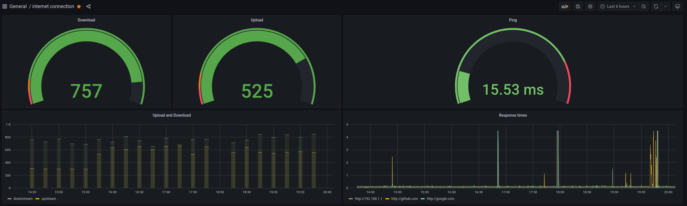

# A Docker Stack which Monitors your home network
Here's a quick guide to start up a Docker stack containing [Prometheus](http://prometheus.io/), Grafana with  [blackbox-exporter](https://github.com/prometheus/blackbox_exporter) and [speedtest-exporter](https://github.com/stefanwalther/speedtest-exporter) to collect and graph home network connections and speed.

<center></center>

## Prerequisites
Ensure you have the latest version of docker and [docker-compose](https://docs.docker.com/compose/install/) on your host machine.

# Installation


Start off by cloning this repository to a folder of choice. You cannot change the location of this folder afterwards as it includes config files which this Docker stack uses!
```
git clone https://github.com/Quinten0508/internet-monitoring
cd internet-monitoring/prometheus
```

### Configuration
To change what hosts you ping you can change the `targets` section in the [/prometheus/pinghosts.yaml](./prometheus/pinghosts.yaml) file.
By default, these hosts are pinged:
```
http://google.com;google.com;external;internetbox
http://github.com;github.com;external;internetbox
http://192.168.1.1;internetbox;local;internetbox
```

You can also change the interval at which Speedtest tests your internet speeds. This interval is at 5 minutes by default which might be too much if you have a metered connection. The interval can be changed by editing `scrape_interval` under `speedtest` in [/prometheus/prometheus.yml](./prometheus/prometheus.yml).


Once configurations are done you may run the docker-compose script from the [/prometheus](./prometheus/) project directory.

```
$ cd prometheus/
$ docker-compose up -d
````
That's all. docker-compose builds the entire stack automagically. 


# Usage

The Grafana Dashboard is now accessible via: `http://<Host IP Address>:3030`, for example http://localhost:3030 or http://192.168.1.20:3030.

The default username is `admin` and the default password is `wonka`. 
**Change these as soon as you are logged** in via the settings panel!

You can access the internet-monitoring dashboard directly at http://localhost:3030/d/o9mIe_Aik/internet-connection - if no data shows up change the time scale to something smaller like 5 minutes.

# Interesting URLs
* http://localhost:9090/targets shows the status of monitored targets as seen from prometheus - in this case which hosts are being pinged and speedtest. note: speedtest will take a while before it shows as UP as it takes ~30s to respond.

* http://localhost:9090/graph?g0.expr=probe_http_status_code&g0.tab=1 shows prometheus value for `probe_http_status_code` for each host. You can edit/play with additional values. Useful to check everything is okay in prometheus (in case Grafana is not showing the data you expect).

* http://localhost:9115 blackbox exporter endpoint. Lets you see what have failed/succeded.

* http://localhost:9696/metrics speedtest exporter endpoint. Does take ~30 seconds to show its result as it runs an actual speedtest when requested.

Note: replace `localhost` with your host ip address.*

## Thanks and a disclaimer
Thanks to @vegasbrianc work on making a [super easy docker stack](https://github.com/vegasbrianc/github-monitoring) for running prometheus and grafana.

I also want to disclaim that Prometheus aren't really (currently) intended for this kind of blackbox/external monitoring and this setup is not in anyway secured. Thus only use this for inspiration and do not blame me if someone hacks this and figures out what your real internet speed is :)
If you decide to open the Grafana dashboard up to the rest of the world, keep this in mind and secure it with an authentication provider like [Authelia](https://www.authelia.com/) if necessary!
